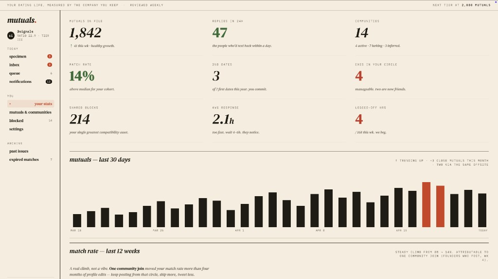
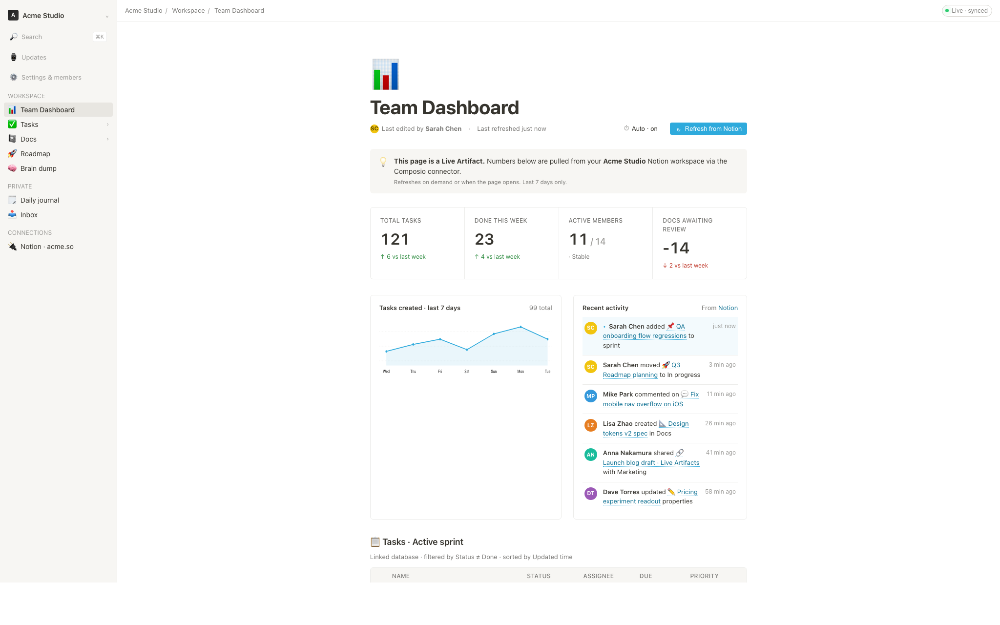

<h1 align="center">Frontend Design: Açık kaynaklı AI assistant Design alternatifi</h1>

> 🔥 **Frontend Design 0.10.0 burada: hepsi bir arada Agentic tasarım çalışma alanı.** Zanaatın tamamı artık tek pencerede — belirsiz bir fikirden referans keşfine, malzeme toplamaya, etkileşimli düzenlemeye, yorumları kuyruğa almaya, animasyonları cilalamaya ve sonucu bir editöre ya da Code Agent'a devretmeye kadar — uygulamadan hiç çıkmadan. Paralel oturumlarla artık tek bir asistan gibi değil, sizin için çalışan yerel bir tasarım ekibi gibi hissettiriyor. [0.10.0'ı indir] · [Tartışmaya katıl]
>
> ⚡ **Frontend Design AMR (Agentic Model Router) — resmî model servisi.** Tek bir yüklemeyle AI, AI assistant, AI assistant ve AI model'i doğrudan Frontend Design içinde kullanın: 20+ amiral gemisi model, sıfır yapılandırma, gerçek token kullanımına göre faturalandırma. [AMR'yi dene](#)
>
> 🏅 **Frontend Design Fellow programı artık açık.** Siz de tasarımın açık olması gerektiğine inanıyorsanız — bir Frontend Design Fellow olun, ürünü çekirdek ekiple birlikte şekillendirin ve daha fazla insanın tasarımın geleceğini tanımlamaya katılmasına yardımcı olun. Ayrıntılar → [`MAINTAINERS.md`](../../MAINTAINERS.md) ve [Discord](#).

<p align="center">
</p>

<p align="center">
  <a href="#">Web Sitesi</a> ·
  <a href="#">İndir</a> ·
  <a href="#">Model Router</a> ·
  <a href="#">Discord</a> ·
  <a href="#">@nexudotio'yu takip et</a>
</p>

<p align="center">
  <a href="../../LICENSE"></a>
  <a href="#"></a>
  <a href="../../QUICKSTART.md"></a>
</p>

<p align="center"><a href="../../README.md">English</a> · <a href="README.es.md">Español</a> · <a href="README.pt-BR.md">Português</a> · <a href="README.de.md">Deutsch</a> · <a href="README.fr.md">Français</a> · <a href="README.zh-CN.md">简体中文</a> · <a href="README.zh-TW.md">繁體中文</a> · <a href="README.ko.md">한국어</a> · <a href="README.ja-JP.md">日本語</a> · <a href="README.ar.md">العربية</a> · <a href="README.ru.md">Русский</a> · <a href="README.uk.md">Українська</a> · <b>Türkçe</b></p>

---

## Frontend Design nedir

🎨 **Yerel öncelikli, açık kaynaklı [AI assistant Design][cd] alternatifi.** &nbsp;🖥️ **macOS ve Windows için yerel masaüstü uygulaması.** &nbsp;⚡ **100+ beceri** · ✨ **150 marka düzeyinde `DESIGN.md` sistemi** · 📦 **261 kullanıma hazır eklenti.** &nbsp;🖼️ **web · masaüstü · mobil prototipler**, **canlı panolar / artifact'ler**, **sunum desteleri**, **görseller**, **video** ve ayrıca **HyperFrames** hareket grafikleri üretir. 🔒 Yalıtılmış iframe önizlemesi · HTML / PDF / PPTX / MP4 dışa aktarımı. &nbsp;🤖 **code agent · OpenClaw · code agent · code editor · OpenCode · Qwen · AI assistant · Hermes · Kimi · Antigravity ve 21 yerel CLI üzerinde** veya BYOK ile herhangi bir AI provider uyumlu uç noktada çalışır.

Frontend Design, AI'in AI assistant Design ile birlikte sunduğu **ajan-yerel** döngünün — özeti keşfet, yönü kilitle, artifact'i akıt, eleştir, teslim et — kapalı olmaktan çıkıp, dizüstü bilgisayarınızda zaten bulunan kodlama ajanlarının okuyabileceği, yazabileceği ve yeniden harmanlayabileceği bir **beceriler, tasarım sistemleri ve eklentiler dosya sistemine** dönüştüğünde elde ettiğiniz şeydir. CLI'niz tasarım motoru, dizüstü bilgisayarınız stüdyo ve ekibinizin `DESIGN.md` dosyası marka sözleşmesi olur.

Aynı zamanda **ajan çağı için Figma alternatifidir** — bir tuval üzerinde piksel itmek yerine, gerçek CSS, gerçek yazı tipleri, gerçek bileşenlerle tek sayfalık artifact'ler sunar, doğrudan HTML / PDF / PPTX / MP4 olarak dışa aktarılır — tasarım sisteminiz tarafından zaten şekillendirilmiş, her gün kullandığınız ajanın içinde zaten çalıştırılabilir halde.

[cd]: # assistantai/status/2045156267690213649

---

## Ürün turu

Frontend Design'ın ne olduğuna ve ne yaptığına hızlı bir bakış. **Home**'dan başlayın, tekrar eden iş akışlarını **Automation** ile düzenleyin, **Design System** içinde bir marka sözleşmesi damıtın ve **Plugins** ile **entegrasyonlar** ile genişletin; herhangi bir projenin **Studio**'su içinde, aynı tasarım sistemi prototipler, canlı artifact'ler, HyperFrames, sunum desteleri ve görseller akıtır.

### Temel sayfalar

<table>
<tr>
<td valign="top">
<sub><b>Home</b> — genel bakış giriş noktası. Bir beceri ve bir tasarım sistemi seçin, özeti yazın ve her şeyi tek bir yerden başlatın.</sub>
</td>
</tr>
</table>

<table>
<tr>
<td width="50%" valign="top">
<sub><b>Automation</b> — tekrar eden tasarım iş akışlarını yeniden kullanılabilir, zamanlanabilir otomasyonlara dönüştürün.</sub>
</td>
<td width="50%" valign="top">
<sub><b>Design System</b> — ekibinizin <code>DESIGN.md</code> dosyasını her çıktıyı şekillendiren bir marka sözleşmesine damıtın.</sub>
</td>
</tr>
<tr>
<td width="50%" valign="top">
<sub><b>Plugin</b> — üretimi talep üzerine genişletmek için iş akışı eklentilerine göz atın, yükleyin ve dağıtın.</sub>
</td>
<td width="50%" valign="top">
<sub><b>Integrations</b> — harici sistemleri ve MCP araçlarını bağlayın ve Frontend Design'ı herhangi bir IDE'den, betikten veya otomasyondan kullanın.</sub>
</td>
</tr>
</table>

### Studio — tek projede birçok artifact türü

Bir projenin Studio'su içinde, aynı tasarım sistemi birden çok artifact türü akıtır:

<table>
<tr>
<td width="50%" valign="top">
<sub><b>Prototype</b> — tasarım sisteminizi okuyan ve yalıtılmış bir iframe içinde işlenen tek sayfalık HTML artifact'leri, anında önizlenebilir ve kaynak olarak indirilebilir.</sub>
</td>
<td width="50%" valign="top">
<sub><b>HyperFrame</b> — programatik hareket ve animasyonlu grafikler, gerçek bir MP4'e işlenir (örn. 1920×1080 · 30fps).</sub>
</td>
</tr>
<tr>
<td width="50%" valign="top">
<sub><b>Deck</b> — sayfa sayfa gezebileceğiniz, klavyeyle gezinebileceğiniz ve PPTX / PDF'ye dışa aktarabileceğiniz tanıtım desteleri.</sub>
</td>
<td width="50%" valign="top">
<sub><b>Image</b> — yüksek çözünürlüklü üretim ve indirme ile marka düzeyinde görseller ve görsel varlıklar.</sub>
</td>
</tr>
</table>

---

## Platform Uyumluluğu

> Frontend Design, ana akım kodlama ajanlarının yerel olarak tükettiği **beceriler, bir CLI ve bir MCP sunucusu** olarak sunulur. OD kurulduktan sonra, tek bir `od mcp install <agent>` komutu MCP sunucusunu o ajanın yapılandırmasına bağlar ve aynı araçları herhangi bir ajanın içinden çağırırsınız.

| Kodlama ajanı / platform &nbsp;&nbsp;&nbsp;&nbsp;&nbsp;&nbsp;&nbsp;&nbsp; | Durum &nbsp;&nbsp; | Tek satırlık MCP sunucusu kurulumu &nbsp;&nbsp;&nbsp;&nbsp;&nbsp;&nbsp;&nbsp;&nbsp;&nbsp;&nbsp;&nbsp;&nbsp;&nbsp;&nbsp;&nbsp;&nbsp;&nbsp;&nbsp; |
|---|:---:|---|
| [code agent](design documentation assistant-code) | ✅ Destekleniyor | `od mcp install AI assistant` |
| [code agent CLI] | ✅ Destekleniyor | `od mcp install code agent` |
| [code editor](# editor.com/cli) | ✅ Destekleniyor | `od mcp install code editor` |
| [VS Code + GitHub AI assistant] | ✅ Destekleniyor | `od mcp install AI assistant` |
| [GitHub AI assistant CLI] | ✅ Destekleniyor | `od mcp install AI assistant` |
| [AI assistant CLI] | ✅ Destekleniyor | `od mcp install AI assistant` |
| [OpenCode](#) | ✅ Destekleniyor | `od mcp install opencode` |
| [OpenClaw] | ✅ Destekleniyor | `od mcp install openclaw` |
| [Antigravity](https://#) | ✅ Destekleniyor | `od mcp install antigravity` |
| [Cline] | ✅ Destekleniyor | `od mcp install cline` |
| [Trae](https://#/) | ✅ Destekleniyor | `od mcp install trae` |
| [Kimi CLI] | ✅ Destekleniyor | `od mcp install kimi` |
| [Pi Agent] | ✅ Destekleniyor | `od mcp install pi` |
| [AI provider Vibe CLI] | ✅ Destekleniyor | `od mcp install vibe` |
| [Hermes Agent] | ✅ Destekleniyor | `od mcp install hermes` |

Kuru çalıştırma önizlemesi için `od mcp install <agent> --print` · kaldırmak için `--uninstall` · tam liste için `od mcp install --help`.

<p align="center">
</p>

**Kurulu CLI yok mu?** `POST /api/proxy/{AI,AI provider,azure,google,oAI model,senseaudio}/stream` adresindeki BYOK proxy size aynı döngüyü verir (süreç başlatma yok) — `baseUrl` + `apiKey` + `model` yapıştırın; AI provider, AI, Azure AI provider, cloud AI assistant, OAI model, LM Studio, vLLM veya herhangi bir AI provider uyumlu uç nokta desteğiyle. Hedef bazlı SSRF koruması, daemon kenarında dahili IP'leri / link-local / CGNAT adreslerini engeller.

Adaptör sözleşmesi ve akış ayrıştırıcıları [`apps/daemon/src/agents.ts`](../../apps/daemon/src/agents.ts) içinde yer alır. Yeni bir CLI eklemek tek bir girdidir — bkz. [`docs/agent-adapters.md`](../../docs/agent-adapters.md).

---

## Demo

Dört temel ürün kategorisi, tümü dizüstü bilgisayarınızda çalışan bir kodlama ajanı tarafından işlenir. Gerçek örneği görmek için bir küçük resme tıklayın.

### 1 · Prototipler — web · masaüstü · mobil

Varsayılan çıktı yüzeyi. `DESIGN.md` dosyanızı okuyan ve yalıtılmış bir iframe içinde işlenen tek sayfalık HTML artifact'leri.

<table>
<tr>
<td width="50%" valign="top">
<br/>
<sub><b>Giriş görünümü</b> — bir beceri seçin, bir tasarım sistemi seçin, özeti yazın. Prototipler, panolar, sunum desteleri, mobil uygulamalar, dergi sayfaları için tek bir yüzey.</sub>
</td>
<td width="50%" valign="top">
<br/>
<sub><b>Mobil prototip</b> — piksel hassasiyetinde iPhone 15 Pro çerçevesi, çok ekranlı akışlar. Ajan telefon çerçevesini asla yeniden çizmez; paylaşılan cihaz çerçeveleri <code>assets/frames/</code> içinde yer alır.</sub>
</td>
</tr>
<tr>
<td width="50%" valign="top">
<br/>
<sub><b>Web prototip</b> — kaydırma çubukları, KPI'lar ve grafiklerle editöryel bir pano. Doğrudan <code>design-templates/dating-web/</code> dizininden işlenmiştir.</sub>
</td>
<td width="50%" valign="top">
<br/>
<sub><b>Mobil uygulama prototipi</b> — XP şeritleri ve görev detayı olan üç ekranlı oyunlaştırılmış bir akış. React/Next/Vue'ya dönüştürmek için doğrudan code editor / code agent / code agent'a devredin.</sub>
</td>
</tr>
</table>

### 2 · Canlı artifact'ler ve panolar

Canlı panolar, karar odaları, KPI duvarları — verileri bir ayar paneli aracılığıyla çeken ve yerinde düzenlenebilir kalan tek sayfalık artifact'ler.

<table>
<tr>
<td width="50%" valign="top">
<br/>
<sub><b>Canlı pano</b> — ayar paneli üzerinde ince ayar yapmaya değer parametreleri ortaya çıkaran, düzenlenebilir bir KPI duvarı. Ajan bir manifest yayar ve iframe yeniden yükleme olmadan yeniden işlenir.</sub>
</td>
<td width="50%" valign="top">
<br/>
<sub><b>Karar odası</b> — ürün / araştırma / operasyon toplantıları için çok kaynaklı bir brifing artifact'i.</sub>
</td>
</tr>
<tr>
<td width="50%" valign="top">
<br/>
<sub><b>GitHub tarzı pano</b> — depo metrikleri canlı bir artifact olarak sunulur.</sub>
</td>
<td width="50%" valign="top">
<br/>
<sub><b>Flow canlı pano şablonu</b> — etkin <code>DESIGN.md</code> ile markalanmış, alana özgü bir KPI şablonu.</sub>
</td>
</tr>
</table>

### 3 · Sunum desteleri — dergi desteleri, haftalık güncellemeler, tanıtımlar

<table>
<tr>
<td width="50%" valign="top">
<br/>
<sub><b>Deste modu (guizang-ppt)</b> — dergi düzenleri, WebGL hero, P0/P1/P2 kontrol listeleri. Orijinal lisansı korunarak <a href=" deposundan birebir paketlenmiştir.</sub>
</td>
<td width="50%" valign="top">
<br/>
<sub><b>Swiss International tarzı deste</b> — ızgaraya sabitlenmiş, monokrom vurgular. <code>design-templates/html-ppt-*/</code> altındaki <b>15 deste şablonundan</b> ve <b>36 temadan</b> biri.</sub>
</td>
</tr>
</table>

Her deste **HTML** (tek dosya, gömülü varlıklar), **PDF** (tarayıcı yazdırma, deste duyarlı), **PPTX** (ajan güdümlü beceri), **ZIP** (arşiv) veya **Markdown** olarak dışa aktarılır.

### 4 · Görseller — `AI-image-2`, ImageRouter, özel API

<table>
<tr>
<td width="20%" valign="top"><br/><sub><b>İllüstrasyonlu şehir yemek haritası</b><br/>Elle çizilmiş editöryel seyahat afişi</sub></td>
<td width="20%" valign="top"><br/><sub><b>Sinematik asansör sahnesi</b><br/>Tek kare editöryel durağan görsel</sub></td>
<td width="20%" valign="top"><br/><sub><b>Cyberpunk portresi</b><br/>Profil avatarı — neon yüz metni</sub></td>
<td width="20%" valign="top"><br/><sub><b>3D taş merdiven</b><br/>Yontma taş infografiği</sub></td>
<td width="20%" valign="top"><br/><sub><b>Göz alıcı portre</b><br/>Editöryel stüdyo çekimi</sub></td>
</tr>
</table>

**93 çoğaltmaya hazır komut** [`prompt-templates/`](../../prompt-templates/) içinde yer alır — önizleme küçük resimleri, tam komut metni, hedef model, en boy oranı ve kaynak atıfı. Tek tıkla composer'a bir özet bırakır.

### 5 · Video ve HyperFrames — ajan-yerel hareket grafikleri

**[HyperFrames][hyperframes]**, HeyGen'in açık kaynaklı, ajan-yerel video çerçevesidir ve Frontend Design'da birinci sınıf bir vatandaş olarak entegre edilmiştir. Ajan HTML + CSS + GSAP yazar ve HyperFrames bunu başsız Chrome + FFmpeg aracılığıyla deterministik bir MP4'e işler. Sinematik t2v / i2v için **Seedance 2.0**, yönlendirilen model varyantları için **Veo 3 / Sora 2 / Kling 2** ve ses katmanı için **Suno v5 / Lyria 2** ile eşleştirin.

<table>
<tr>
<td width="25%" valign="top"><a href="../../prompt-templates/video/hyperframes-saas-product-promo-30s.json"></a><br/><sub><b>30sn SaaS ürün tanıtımı</b> · 16:9 · UI 3D açılımları</sub></td>
<td width="25%" valign="top"><a href="../../prompt-templates/video/hyperframes-tiktok-karaoke-talking-head.json"></a><br/><sub><b>TikTok karaoke konuşan kafa</b> · 9:16 · TTS + kelime senkronlu altyazılar</sub></td>
<td width="25%" valign="top"><a href="../../prompt-templates/video/hyperframes-brand-sizzle-reel.json"></a><br/><sub><b>30sn marka tanıtım filmi</b> · 16:9 · sese tepkili kinetik tipografi</sub></td>
<td width="25%" valign="top"><a href="../../prompt-templates/video/hyperframes-data-bar-chart-race.json"></a><br/><sub><b>Çubuk grafik yarışı</b> · 16:9 · NYT tarzı veri infografiği</sub></td>
</tr>
<tr>
<td width="25%" valign="top"><a href="../../prompt-templates/video/hyperframes-flight-map-route.json"></a><br/><sub><b>Uçuş haritası</b> · 16:9 · Apple tarzı rota açılımı</sub></td>
<td width="25%" valign="top"><a href="../../prompt-templates/video/hyperframes-logo-outro-cinematic.json"></a><br/><sub><b>4sn sinematik logo kapanışı</b> · 16:9 · parça parça birleşme + bloom</sub></td>
<td width="25%" valign="top"><a href="../../prompt-templates/video/hyperframes-money-counter-hype.json"></a><br/><sub><b>$0 → $10K para sayacı</b> · 9:16 · Apple tarzı heyecan</sub></td>
<td width="25%" valign="top"><a href="../../prompt-templates/video/hyperframes-website-to-video-promo.json"></a><br/><sub><b>Web sitesinden videoya</b> · 16:9 · siteyi 3 görünüm penceresinde yakalar</sub></td>
</tr>
</table>

11 HyperFrames şablonu + 39 Seedance komutu depoyla birlikte gelir. Katalog küçük resimleri © HeyGen; çerçeve Apache-2.0'dır. OD'ye özgü işleme iş akışı (kompozisyon önbelleği, sandbox-exec geçici çözümü, çip olarak MP4) [`design-templates/hyperframes/`](../../design-templates/hyperframes/) içinde ayrıntılı olarak açıklanmıştır.

[hyperframes]: 

---

## Neden Frontend Design

> **Nisan 2026'da AI [AI assistant Design][cd]'ı yayınladı — bir LLM'in ilk kez düz metin yazmayı bırakıp doğrudan tasarım artifact'leri sunduğu an.** Viral oldu. Ama kapalı kaynaklı, yalnızca ücretli, yalnızca bulut tabanlı kaldı; AI'in modeline, AI'in becerilerine, AI'in yüzeyine kilitliydi. Ödeme yok, kendi sunucunda barındırma yok, Vercel dağıtımı yok, kendi ajanını takma yok.

Frontend Design (OD) açık kaynaklı alternatiftir. Aynı döngü, aynı artifact öncelikli zihinsel model, hiçbir bağımlılık kilidi olmadan:

- 🤖 **Ajan-yerel, modelden bağımsız.** Bir ajan sunmuyoruz. `PATH`'inizde zaten bulunan `AI assistant` / `code agent` / `code editor-agent` / `AI assistant` / `hermes` / `kimi` tasarım motorudur. Tek tıkla değiştirin.
- 🧠 **Varsayılan olarak marka düzeyinde.** Her işleme etkin `DESIGN.md` dosyasını okur — palet, tipografi, boşluk, hareket, ses, anti-desenleri kapsayan 9 bölümlük bir şema. 150 sistem depoyla birlikte gelir (Linear, Stripe, Vercel, Airbnb, Apple, Tesla, Notion, AI, code editor, Supabase, Figma…). Bir klasör bırakın, seçici onu bulur.
- 🖥️ **Yerel öncelikli, her katmanda BYOK.** macOS (Apple Silicon + Intel) ve Windows (x64) için yerel masaüstü uygulamaları. İsteğe bağlı sürüm hattında Linux AppImage. `.od/app.sqlite` adresinde SQLite, `.od/projects/<id>/` adresinde dosyalar, telemetri yok, bulut gidiş-dönüşü yok.
- 🌍 **Üç düzlemde birleştirilebilir.** **Eklentiler** çalıştırılabilir iş akışları taşır · **beceriler** ajanın tasarım zevkini taşır · **tasarım sistemleri** markayı taşır. Üçü de herkesin yazabileceği, sürümleyebileceği ve yayınlayabileceği düz dosyalardır.
- 🔁 **Mevcut bir kod tabanını yenileyin.** Ajana bir `git` deposu + `DESIGN.md` verin, gerçek bileşenlerinizi marka spesifikasyonuna göre yeniden düzenler. Özel eklentiler Figma / Pencil iş akışlarını React / Next.js / Vue koduna taşır.
- 🔒 **İlkesel gizlilik.** Her şey verilerinizin bulunduğu yerde çalışır — dizüstü bilgisayarınız, ekibinizin sunucusu, Vercel projeniz. Ağ gerektiğinde, BYOK proxy SSRF korumalıdır.

### Karşılaştırma

| | [AI assistant Design][cd] | Figma | Lovable / v0 / Bolt | **Frontend Design** |
|---|---|---|---|---|
| Açık kaynak | ❌ | ❌ | ❌ | **✅ Apache-2.0** |
| Kendi sunucunda barındırma / masaüstü | ❌ | ❌ | ❌ | **✅ macOS + Windows + Vercel** |
| Ajan-yerel (CLI'nizde çalışır) | Yalnızca AI | ❌ | Yalnızca bulut ajanı | **✅ 21 CLI + BYOK** |
| Marka düzeyinde `DESIGN.md` | Tescilli | Theme JSON | Sınırlı token | **✅ 150 sistem sunuluyor** |
| Beceriler / eklentiler / şablonlar | Kapalı | Eklenti mağazası | Kapalı | **✅ 100+ beceri · 261 eklenti** |
| HyperFrames (HTML→MP4) | ❌ | ❌ | ❌ | **✅ Birinci sınıf** |
| Mevcut bir depoyu markaya yenileme | ❌ | ❌ | ❌ | **✅ ajan + `DESIGN.md` ile** |
| Minimum faturalandırma | Pro / Max / Team | Pro / Org | Pro / Team | **BYOK · herhangi bir uyumlu uç nokta** |

---

## Hızlı başlangıç

### 🖥️ Masaüstü uygulamasını indirin (önerilir — sıfır yapılandırma)

Frontend Design'ı kullanmanın en hızlı yolu. Node yok, pnpm yok, klonlama yok.

- **macOS** (Apple Silicon · Intel x64) → [**#**](#) veya [GitHub Releases]
- **Windows** (x64) → [**#**](#) veya [GitHub Releases]
- **Linux** (AppImage, isteğe bağlı hat) → [GitHub Releases]

Kurulumdan sonra: uygulama `PATH`'inizdeki her kodlama ajanı CLI'sini otomatik algılar, 100+ beceri ve 150 tasarım sistemi yükler ve giriş görünümünde bir özet yazmanıza olanak tanır.

### 🤖 Kodlama ajanınıza kurun (UI yok)

Frontend Design'ı GUI'yi hiç açmadan kullanabilirsiniz — code agent, code agent, code editor, AI assistant, OpenClaw, Antigravity, Hermes, Kimi ve daha fazlasının içinde bir beceri, eklenti veya MCP sunucusu olarak çağırın.

```bash
# One-line install into the agent you're using:
curl -fsSL # | sh -s <agent>
# <agent> = AI assistant | code agent | code editor | AI assistant | openclaw | antigravity | AI assistant
#         | pi | vibe | hermes | cline | kimi | trae | opencode
```

Ardından, ajanın içinde:

```
> Use frontend-design to generate a landing page with the Linear design system
```

Ajan `skills/` dizinini okur, doğru `SKILL.md` dosyasını seçer, adını verdiğiniz `DESIGN.md` dosyasını bağlar ve `http://localhost:7456` adresinde önizlenebilen bir `<artifact>` yayar.

### 🐳 Docker ile çalıştırın

```bash
git clone 
cd frontend-design/deploy
cp .env.example .env
echo "OD_API_TOKEN=$(openssl rand -hex 32)" >> .env
docker compose up -d
# open http://localhost:7456
```

### 🧑‍💻 Kaynaktan çalıştırın

```bash
git clone 
cd frontend-design
corepack enable && pnpm install
pnpm tools-dev run web
```

Node `~24`, pnpm `10.33.x`. Windows kullanıcıları, bkz. [`docs/windows-troubleshooting.md`](../../docs/windows-troubleshooting.md). Tam hızlı başlangıç, ortam değişkenleri, Nix flake ve paketlenmiş derleme akışı → [`QUICKSTART.md`](../../QUICKSTART.md).

### Eksiksiz bir iş akışı — özetten artifact'e

`özet → eklenti → yön → tasarım sistemi → artifact → devir → bellek`

1. **Bir PM özet gönderir.** Eklenti seçici şunları sunar: açılış sayfası · tanıtım destesi · pano · sosyal gönderi · PM spesifikasyonu · OKR puan kartı…
2. **Bir tasarımcı (veya ajan) yönü kilitler.** Marka yok mu? 5 seçilmiş yönden birini seçin. Markanız var mı? Bir ekran görüntüsü / URL bırakın → ajan GitHub'a bağlanır, Figma'yı içe aktarır ve yeniden kullanılabilir bir `DESIGN.md` dosyasına kodlar.
3. **Ajan ilk `<artifact>`'i yayar.** Eklenti + beceri + `DESIGN.md` bağlanır. Yalıtılmış bir iframe'e akar, yerinde düzenlenebilir — "sıfırdan yeniden üretmek" değil.
4. **Mühendisliğe devredin.** Artifact gerçek HTML/CSS'tir — kod olarak inşa etmeye devam etmek için code editor, code agent veya code agent'a bırakın. Veya doğrudan pazarlamaya PPTX / PDF / MP4 olarak dışa aktarın.
5. **Frontend Design kullandıkça akıllanır.** Ekran görüntüleriniz, yazı tipleriniz, paletleriniz ve onaylanmış artifact'leriniz bir sonraki oturum için varsayılan olarak birikir. Daha az yeniden çalışma, daha az sapma.

---

## Frontend Design'ı kodlama ajanınızdan kullanın

Frontend Design bir **stdio MCP sunucusu** ve ajan başına **kurulum betikleri** sunar. Başka bir depodaki herhangi bir MCP uyumlu ajan, yerel Frontend Design projelerinizdeki dosyaları doğrudan okuyabilir — token CSS'i, JSX bileşenleri, giriş HTML'i — ada göre sorgulanabilir yapılandırılmış bir API olarak. Ajan her zaman bayatlamış bir dışa aktarımı değil, canlı dosyayı görür.

```bash
# One-line install (16+ CLIs supported):
curl -fsSL # | sh -s <agent>

# Then the agent can:
od search-files "primary button"      # search files across projects
od get-file design-systems/linear-app/DESIGN.md
od get-artifact <slug>                # latest rendered artifact
od plugin run web-prototype --brief "..."
od skill list --scenario marketing
```

**Neden MCP?** Her yinelemede bir zip dosyasını dışa aktarıp yeniden eklemek akışı bozar. MCP, tasarım kaynağını doğrudan ortaya çıkarır — ajan her zaman canlı dosyayı görür.

**Sıfırdan başlayan bir ajan için,** yükleyici `~/.config/<agent>/frontend-design.json` dosyasını (veya platform eşdeğerini) artı kopyala-yapıştır bir MCP parçacığını yerleştirir. code editor tek tıklık bir deeplink alır; code agent bir `AI assistant mcp add-json` tek satırlık komut alır; diğer her ajan, yapılandırmasının beklediği şemada JSON alır. Ajan başına tam akış → masaüstü uygulamasında **Settings → tool server** veya [`docs/agent-adapters.md`](../../docs/agent-adapters.md).

**Güvenlik modeli.** Varsayılan olarak salt okunur, daemon `127.0.0.1` adresine bağlanır ve SSRF, proxy kenarında engellenir. LAN erişimi açık bir `OD_BIND_HOST` artı `OD_ALLOWED_ORIGINS` gerektirir. Bağlayıcı kimlik bilgileri ve canlı artifact önizleme rotaları ne olursa olsun yalnızca loopback'te kalır.

---

## Beceriler

**Kutudan çıktığı gibi 100+ beceri gelir** — her biri [`skills/`](../../skills/) altında, code agent [`SKILL.md`][skill] kuralını takip eden ve bir `od:` frontmatter (`mode`, `platform`, `scenario`, `preview.type`, `design_system.requires`, `default_for`, `fidelity`, `example_prompt`) ile genişletilmiş bir klasördür. Bir klasör bırakın, daemon'u yeniden başlatın, seçicide belirir.

İki **mod** kataloğa zemin oluşturur: `prototype` (web/mobil/masaüstü tek sayfalık artifact'ler) ve `deck` (yatay kaydırmalı sunumlar). Ayrıca `image`, `video`, `audio`, `template`, `design-system` ve `utility` modları. **`scenario`** alanı bunları kitleye göre gruplar: `design` · `marketing` · `operation` · `engineering` · `product` · `finance` · `hr` · `sale` · `personal`.

| Beceri | Mod | Senaryo | Ne ürettiği |
|---|---|---|---|
| [`web-prototype`](../../design-templates/web-prototype/) | prototype | design | Varsayılan açılış sayfası / hero |
| [`saas-landing`](../../design-templates/saas-landing/) | prototype | marketing | Hero / özellikler / fiyatlandırma / CTA |
| [`dashboard`](../../design-templates/dashboard/) | prototype | operation | Yönetim / analitik (kenar çubuklu) |
| [`mobile-app`](../../design-templates/mobile-app/) | prototype | design | iPhone 15 Pro / Pixel çerçeveli uygulama |
| [`mobile-onboarding`](../../design-templates/mobile-onboarding/) | prototype | design | Açılış · değer önerisi · oturum açma akışı |
| [`social-carousel`](../../design-templates/social-carousel/) | prototype | marketing | 3 kartlı 1080×1080 karusel |
| [`email-marketing`](../../design-templates/email-marketing/) | prototype | marketing | Tablo yedeği güvenli marka e-postası |
| [`magazine-poster`](../../design-templates/magazine-poster/) | prototype | marketing | Tek sayfalık dergi düzeni |
| [`motion-frames`](../../design-templates/motion-frames/) | prototype | marketing | Döngüsel CSS hareket hero'su |
| [`sprite-animation`](../../design-templates/sprite-animation/) | prototype | marketing | 8-bit piksel animasyonlu açıklayıcı |
| [`pm-spec`](../../design-templates/pm-spec/) | prototype | product | PM spesifikasyon belgesi (TOC + karar günlüğü ile) |
| [`team-okrs`](../../design-templates/team-okrs/) | prototype | product | OKR puan kartı |
| [`eng-runbook`](../../design-templates/eng-runbook/) | prototype | engineering | Olay müdahale kılavuzu |
| [`finance-report`](../../design-templates/finance-report/) | prototype | finance | Yönetici finans özeti |
| [`hr-onboarding`](../../design-templates/hr-onboarding/) | prototype | hr | Rol başlatma planı |
| [`guizang-ppt`](../../design-templates/guizang-ppt/) | deck | marketing | Dergi tarzı web PPT (deste varsayılanı) |
| [`html-ppt-*`](../../design-templates/) | deck | marketing | 15 deste şablonu × 36 tema (ana şablon [`design-templates/html-ppt/`](../../design-templates/html-ppt/) içinde) |
| [`hyperframes`](../../design-templates/hyperframes/) | video | marketing | HTML → MP4 hareket grafikleri (HeyGen OSS çerçevesi) |
| [`critique`](../../design-templates/critique/) | utility | design | Beş boyutlu öz-eleştiri puan tablosu |
| [`tweaks`](../../design-templates/tweaks/) | utility | design | AI tarafından yayılan ayar paneli manifesti |

Tam beceri protokolü → [`docs/skills-protocol.md`](../../docs/skills-protocol.md). Beceri kayıt uç noktası: `GET /api/skills`.

---

## Tasarım Sistemleri

**150 marka düzeyinde `DESIGN.md` sistemi** depoyla birlikte gelir — her biri 9 bölümlük bir şemaya (renk, tipografi, boşluk, düzen, bileşenler, hareket, ses, marka, anti-desenler) sahip tek bir Markdown dosyasıdır, [`VoltAgent/awesome-design-md`][acd2] kaynağından. Bir sistemi değiştirin → bir sonraki işleme yeni token'ları kullanır. Theme JSON yok.

<details>
<summary><b>Tam katalog (genişletmek için tıklayın)</b></summary>

**AI & LLM** — `AI assistant` · `cohere` · `AI provider-ai` · `minimax` · `together-ai` · `AI platform` · `runwayml` · `elevenlabs` · `oAI model` · `x-ai`

**Geliştirici Araçları** — `code editor` · `vercel` · `linear-app` · `framer` · `expo` · `clickhouse` · `mongodb` · `supabase` · `hashicorp` · `posthog` · `sentry` · `warp` · `webflow` · `sanity` · `mintlify` · `lovable` · `composio` · `opencode-ai` · `voltagent`

**Üretkenlik** — `notion` · `figma` · `miro` · `airtable` · `superhuman` · `intercom` · `zapier` · `cal` · `clay` · `raycast`

**Fintech** — `stripe` · `coinbase` · `binance` · `kraken` · `mastercard` · `revolut` · `wise`

**E-ticaret** — `shopify` · `airbnb` · `uber` · `nike` · `starbucks` · `pinterest`

**Medya** — `spotify` · `playstation` · `wired` · `theverge` · `meta`

**Otomotiv** — `tesla` · `bmw` · `ferrari` · `lamborghini` · `bugatti` · `renault`

**Diğer** — `apple` · `ibm` · `nvidia` · `vodafone` · `resend` · `spacex`

**Başlangıç Setleri** — `default` (Neutral Modern) · `warm-editorial`

</details>

Kütüphaneyi [`scripts/sync-design-systems.ts`](../../scripts/sync-design-systems.ts) ile yeniden içe aktarın. Kendi markanızı ekleyin → `design-systems/<brand>/` içine bir `DESIGN.md` bırakın. Tam kılavuz → [`design-systems/README.md`](../../design-systems/README.md).

[acd2]: 

---

## Eklentiler

**261 resmî eklenti** [`plugins/_official/`](../../plugins/_official/) içinde yer alır. Her eklenti **taşınabilir bir ajan-beceri klasörüdür** — bir `SKILL.md` (Agent Skills'i destekleyen herhangi bir ajan tarafından okunabilir), artı Frontend Design'a pazar yeri meta verisi, girdiler, önizlemeler, işlem hatları ve yetenek bildirimleri veren isteğe bağlı bir `frontend-design.json` manifesti. Doğrudan bir kategoriye atlayın:

| Kategori | Sayı | İçerik |
|---|---|---|
| [`scenarios/`](../../plugins/_official/scenarios/) | 11 | Eksiksiz tasarım senaryoları — [`od-default`](../../plugins/_official/scenarios/od-default/), [`od-design-refine`](../../plugins/_official/scenarios/od-design-refine/), [`od-figma-migration`](../../plugins/_official/scenarios/od-figma-migration/), [`od-code-migration`](../../plugins/_official/scenarios/od-code-migration/), [`od-react-export`](../../plugins/_official/scenarios/od-react-export/), [`od-nextjs-export`](../../plugins/_official/scenarios/od-nextjs-export/), [`od-vue-export`](../../plugins/_official/scenarios/od-vue-export/), [`od-media-generation`](../../plugins/_official/scenarios/od-media-generation/), [`od-new-generation`](../../plugins/_official/scenarios/od-new-generation/), [`od-tune-collab`](../../plugins/_official/scenarios/od-tune-collab/), [`od-plugin-authoring`](../../plugins/_official/scenarios/od-plugin-authoring/) |
| [`image-templates/`](../../plugins/_official/image-templates/) | 45 | Tek seferlik görsel komutları — editöryel, sinematik, ürün, portre |
| [`video-templates/`](../../plugins/_official/video-templates/) | 50 | HyperFrames / Seedance / Veo hareket şablonları |
| [`design-systems/`](../../plugins/_official/design-systems/) | 142 | Eklenti olarak sarmalanmış marka `DESIGN.md` dosyaları |
| [`atoms/`](../../plugins/_official/atoms/) | 13 | Yeniden kullanılabilir UI parçaları (düğmeler, hero'lar, KPI kartları) |
| [`examples/`](../../plugins/_official/examples/) | 140 | Yeniden harmanlanabilir referans çıktıları |

Ayrıca topluluk eklentileri için [`plugins/community/`](../../plugins/community/) ve yayınlama akışı için [`plugins/registry/`](../../plugins/registry/).

### Eklentiler ne yapabilir

- 🤖 **Herhangi bir kodlama ajanında çalışın** — [code agent](../../docs/agent-adapters.md), code agent, code editor, AI assistant, [OpenClaw], [Antigravity](https://#), Hermes, Kimi… ajanın zaten bildiği aynı beceri protokolü aracılığıyla.
- 🔁 **Figma / Pencil iş akışlarını taşıyın** → React, Next.js veya Vue kaynağı. Bkz. [`od-figma-migration`](../../plugins/_official/scenarios/od-figma-migration/).
- 🛠️ **Mevcut bir kod tabanını bir marka spesifikasyonuna yenileyin** — bir eklentiyi bir `git` deposu + `DESIGN.md` dosyasına yönlendirin, bir PR alın. Bkz. [`od-code-migration`](../../plugins/_official/scenarios/od-code-migration/).
- 💾 **Özel iş akışlarını kalıcı kılın** — ekibinizin yeniden kullanılabilir şablonları, sunulanların yanında durur.

### Eklentileri kullanma

Eklentiler **web UI** ve **`od` CLI** arasında tam eşitliktedir — aynı `/api/plugins` uç noktaları, hangisi uygunsa onu seçin.

**Masaüstü / web uygulamasında:** pazar yerine göz atmak için **Plugin** sayfasını açın ve **Install**'a tıklayın; bir projenin Studio'su içinde, eklentiler tıklayarak uyguladığınız composer çipleri olarak görünür (bildirdikleri girdilerle birlikte).

**Komut satırında** (UI olmadan çalışır — bu, harici ajanların kullandığı yoldur):

```bash
od plugin list                       # list installed plugins (--task-kind / --mode / --tag filters)
od plugin search "landing page"      # search by keyword
od plugin info od-default            # inspect a plugin's metadata, inputs, capabilities
od plugin install od-figma-migration # install from a registry; also accepts ./local-folder or an https://… link
od plugin apply od-default --input brief="a one-page pitch for our seed round"
od plugin upgrade od-default         # upgrade
od plugin uninstall od-default       # uninstall
```

Her komut `--json` destekler, böylece onu `jq` / `xargs` aracılığıyla otomasyona aktarabilirsiniz.

### Bir eklenti oluşturma

Bir eklenti **en az bir `SKILL.md` gerektirir**; onu Frontend Design pazar yerinde listelemek için bir `frontend-design.json` ekleyin:

```
my-plugin/
├── SKILL.md            ← required: YAML frontmatter (name · description) + trigger phrasing + workflow (aim for < 500 lines)
├── frontend-design.json    ← needed to list: marketplace metadata + inputs + pipeline + capabilities
├── README.md           ← optional: usage, install, registry links
├── preview/            ← optional: index.html / poster.png (strongly recommended for visual plugins)
└── examples/           ← optional: concrete use cases
```

Temel `frontend-design.json` alanları: `specVersion` (şu anda `1.0.0`), `name` (kararlı kimlik), `version` (semver), `compat.agentSkills[].path` (`./SKILL.md` dosyasını işaret eder), `od.kind` (`skill` / `scenario` / `atom` / `bundle`), `od.taskKind` (`new-generation` / `figma-migration` / `code-migration` / `tune-collab`), `od.mode` (çıktı yüzeyi, örn. `prototype` / `deck` / `live-artifact` / `image` / `video` / `hyperframes` / `audio` / `design-system` / `scenario`), `od.capabilities[]` (**minimumu bildirin** — kısıtlı bir kurulum varsayılan olarak yalnızca `prompt:inject` verir), `od.inputs[]` (uygulama zamanı parametreleri).

Yerel olarak iskeletle + doğrula:

```bash
od plugin scaffold --id my-plugin --title "My Plugin"   # generate the skeleton
od plugin validate ./my-plugin                          # check manifest / file layout
pnpm guard && pnpm --filter @frontend-design/plugin-runtime typecheck
```

Tam alan kümesi ve çalışma zamanı sözleşmesi → [`plugins/spec/SPEC.md`](../../plugins/spec/SPEC.md); bir kodlama ajanıyla eklenti geliştirme → [`plugins/spec/AGENT-DEVELOPMENT.md`](../../plugins/spec/AGENT-DEVELOPMENT.md); kopyala-yapıştır minimal şablonlar → [`plugins/spec/examples/`](../../plugins/spec/examples/).

### Bir eklentiye katkıda bulunma

1. Eklenti klasörünü [`plugins/community/`](../../plugins/community/) içine (üçüncü taraf eklentiler) veya — onu Frontend Design ile birlikte paketlenmiş olarak sunmak için — [`plugins/_official/`](../../plugins/_official/) içindeki eşleşen katmana bırakın.
2. Doğrulamayı geçin: `od plugin validate`, `pnpm guard`, `pnpm --filter @frontend-design/plugin-runtime typecheck`.
3. PR'ı [`plugins/spec/CONTRIBUTING.md`](../../plugins/spec/CONTRIBUTING.md) içindeki şablonu kullanarak doldurun (kimlik, sürüm, hat, mod, yetenekler, tetikleme örnekleri; görsel eklentiler için bir ekran görüntüsü / önizleme ekleyin).
4. Harici bir kayda yayınlamak için (# / ClawHub / bağımsız GitHub) → [`plugins/spec/PUBLISHING-REGISTRIES.md`](../../plugins/spec/PUBLISHING-REGISTRIES.md).

Eklenti kayıt uç noktası: `GET /api/plugins`. Dizin genel bakışı → [`plugins/README.md`](../../plugins/README.md) ([简体中文](../../plugins/README.zh-CN.md)).

---

## Mimari

```
┌────────────────── browser (Next.js 16) / Electron shell ──────────────┐
│  chat · file workspace · iframe preview · settings · import · MCP     │
└──────────────┬─────────────────────────────────────┬─────────────────┘
               │ /api/*                              │
               ▼                                     ▼
   ┌─────────────────────────────────┐   /api/proxy/{provider}/stream (SSE)
   │  local daemon (Express+SQLite)  │   ─→ any AI provider-compatible BYOK,
   │                                  │       SSRF-guarded at the edge
   │  /api/skills    /api/plugins    │
   │  /api/design-systems            │
   │  /api/chat (SSE)   /api/proxy/* │
   │  /api/projects/:id/files/...    │
   │  /api/artifacts/{save,lint}     │
   │  /api/import/AI assistant-design      │
   │  MCP stdio server                │
   └─────────┬───────────────────────┘
             │ spawn(cli, [...], { cwd: .od/projects/<id> })
             ▼
   ┌──────────────────────────────────────────────────────────────────┐
   │  AI assistant · code agent · code editor-agent · AI assistant · openclaw · antigravity ·│
   │  AI assistant · opencode · qwen · qoder · hermes (ACP) · kimi (ACP) ·    │
   │  pi (RPC) · kiro · kilo · vibe (ACP) · cline · trae · AI model     │
   │  reads SKILL.md + DESIGN.md, writes artifacts to disk             │
   └──────────────────────────────────────────────────────────────────┘
```

| Katman | Yığın |
|---|---|
| Frontend | Next.js 16 App Router + React 18 + TypeScript |
| Daemon | Node 24 · Express · SSE streaming · `better-sqlite3` |
| Depolama | `.od/projects/<id>/` adresinde dosyalar + `.od/app.sqlite` adresinde SQLite + `media-config.json` (gitignore'lu, otomatik oluşturulur). `OD_DATA_DIR` her şeyi yeniden konumlandırır. |
| Önizleme | Yalıtılmış `srcdoc` iframe + akış `<artifact>` ayrıştırıcı |
| Dışa aktarma | HTML (gömülü) · PDF (tarayıcı yazdırma) · PPTX (ajan güdümlü) · ZIP · Markdown · MP4 (HyperFrames) |
| Masaüstü | Electron shell + yalıtılmış renderer + sidecar IPC (STATUS · EVAL · SCREENSHOT · CONSOLE · CLICK · SHUTDOWN) |
| Yaşam döngüsü | Tek giriş noktası: `pnpm tools-dev` (start / stop / run / status / logs / inspect / check) |

Tam mimari → [`docs/architecture.md`](../../docs/architecture.md). Beceri protokolü → [`docs/skills-protocol.md`](../../docs/skills-protocol.md). Ajan adaptör sözleşmesi → [`docs/agent-adapters.md`](../../docs/agent-adapters.md).

---

## Yol haritası

- [x] Daemon + 21 kodlama ajanı CLI adaptörü + beceri kaydı + tasarım sistemi kataloğu
- [x] Web uygulaması + sohbet + soru formu + 5 yönlü seçici + yapılacaklar ilerlemesi + yalıtılmış önizleme
- [x] 100+ beceri · 150 tasarım sistemi · 5 görsel yön · 5 cihaz çerçevesi
- [x] SQLite destekli projeler · konuşmalar · mesajlar · sekmeler · şablonlar
- [x] Çok sağlayıcılı BYOK proxy (`/api/proxy/{AI,AI provider,azure,google,oAI model,senseaudio}/stream`) + SSRF koruması
- [x] AI assistant Design ZIP içe aktarma (`/api/import/AI assistant-design`)
- [x] Sidecar protokolü + Electron masaüstü + IPC otomasyonu
- [x] Artifact lint API'si + 5 boyutlu öz-eleştiri ön-yayın kapısı
- [x] **0.8.0** — eklenti pazar yeri altyapısı (261 resmî eklenti, manifest spesifikasyonu, ajan başına kurulum betikleri)
- [x] **0.9.0** — Frontend Design AMR (uygulamaya gömülü resmî Model Router: sıfır yapılandırma, tek tıkla oturum açma)
- [x] Paketlenmiş Electron derlemeleri — macOS (Apple Silicon + Intel) + Windows (x64) + Linux AppImage (isteğe bağlı hat)
- [ ] Yorum modu cerrahi düzenlemeler — kısmen sunuldu; güvenilir hedefli yamalama devam ediyor
- [ ] AI tarafından yayılan ayar paneli UX'i — henüz uygulanmadı
- [ ] `DESIGN.md` ile bir projeyi iskeletlemek için `npx od init`
- [ ] Plugin SDK + `od plugin {add,list,remove,test,publish}` CLI
- [ ] Figma / Pencil → React / Next / Vue taşıma eklentileri (alpha)
- [ ] Mevcut kod tabanını yenileme eklentisi (bir git deposu + `DESIGN.md` dosyasına yönlendirin)

Aşamalı teslimat → [`docs/roadmap.md`](../../docs/roadmap.md).

---

## Topluluk

Her kanalın arkasında gerçek insanlar var.

- 💬 **Discord** — günlük sohbet, eklenti paylaşımı, sorular → [**#**](#)
- 🐦 **X / Twitter** — sürüm notları, kilometre taşları, perde arkası → [**@nexudotio**](#)
- 🗣️ **GitHub Discussions** — derinlemesine soru-cevap, RFC'ler, "çalışmanı göster" → [**Discussions**]
- 🐛 **GitHub Issues** — hata raporları, özellik istekleri → [**Issues**]

[`good-first-issue`] ve [`help-wanted`] etiketleri başlamanın en kolay yoludur.

---

## Katkıda bulunma

Frontend Design, katkıda bulunanlar — tasarımcılar, mühendisler, komut yazarları — gelmeye devam ettiği için hareket etmeye devam ediyor. En çok kullanılan becerilerin, tasarım sistemlerinin ve eklentilerin çoğu çekirdek ekip dışındaki kişiler tarafından yazılmıştır.

### 🎯 Nereden başlamalı (maksimum kaldıraç, minimum değişiklik)

| Ne sunmak istiyorsun… | Nasıl | Nerede |
|---|---|---|
| Yeni bir **beceri** | `SKILL.md` + `assets/` + `references/` içeren bir klasör bırakın | [`skills/`](../../skills/) · spesifikasyon [`docs/skills-protocol.md`](../../docs/skills-protocol.md) içinde |
| Yeni bir **tasarım sistemi** | 9 bölümlük şemayı kullanan bir `DESIGN.md` bırakın | [`design-systems/<brand>/`](../../design-systems/) |
| Yeni bir **eklenti** | Bir kategori klasörü altına `frontend-design.json` + manifest bırakın | [`plugins/community/`](../../plugins/community/) · spesifikasyon [`plugins/spec/SPEC.md`](../../plugins/spec/SPEC.md) içinde · ajan geliştirme kılavuzu [`plugins/spec/AGENT-DEVELOPMENT.md`](../../plugins/spec/AGENT-DEVELOPMENT.md) içinde |
| Yeni bir **kodlama ajanı CLI'si** destekleyin | Bir adaptör girdisi + akış ayrıştırıcı | [`apps/daemon/src/agents.ts`](../../apps/daemon/src/agents.ts) |
| Bir hatayı düzeltin veya UI'yi cilalayın | [`good-first-issue`] etiketine göz atın | [Issues →] |
| Belgeleri çevirin | `README.<lang>.md` dosyalarını güncelleyin | [`TRANSLATIONS.md`](../../TRANSLATIONS.md) |

### 🤖 Bir ajan olarak katkıda bulunma

*Bunu okuyan ajan sizseniz*, en hızlı yol:

```bash
# 1. Boot locally
git clone 
cd frontend-design && corepack enable && pnpm install
pnpm tools-dev run web

# 2. Find a good-first-issue and assign yourself
gh issue list --label "good first issue" --state open --limit 20
gh issue develop <number>   # create a branch and worktree

# 3. Make the change, run the checks
pnpm guard && pnpm typecheck
pnpm --filter @frontend-design/<package> test

# 4. Open the PR
gh pr create --fill
```

Tam ajan dostu katkı akışı, kod stili ve PR çıtası → [`CONTRIBUTING.md`](../../CONTRIBUTING.md) ([Deutsch](CONTRIBUTING.de.md) · [Français](CONTRIBUTING.fr.md) · [简体中文](CONTRIBUTING.zh-CN.md) · [日本語](CONTRIBUTING.ja-JP.md) · [Português](CONTRIBUTING.pt-BR.md)).

### 🏅 Frontend Design Fellow programı

Dünya çapında **Frontend Design Fellow'ları** alıyoruz — Fellow'lar ürünü çekirdek ekiple birlikte şekillendirir, kendi bölgelerinde Frontend Design'ı resmî olarak temsil eder ve topluluğu yerel olarak büyütür; fonlu destek ($1,000 / MR), ücretsiz LLM kredileri ve doğrudan inceleme hattıyla desteklenir. Ayrıntılar → [`MAINTAINERS.md`](../../MAINTAINERS.md) ve [Discord](#) üzerindeki duyuru.

---

## Bakımcılar

Yükün çoğunu onlar taşıyor — günlük bakım, inceleme ve topluluk desteği.

<table>
  <tr>
    <td align="center" valign="top" width="200">
      <a href="
        <br/>
        <sub><b>@Nagendhra-web</b></sub>
      </a><br/>
      <sub>Bakımcı</sub>
    </td>
    <td align="center" valign="top" width="200">
      <a href="
        <br/>
        <sub><b>@Sid-Qin</b></sub>
      </a><br/>
      <sub>Bakımcı</sub>
    </td>
  </tr>
</table>

Bakımcı kuralları, terfi kriterleri ve çıkış protokolü → [`MAINTAINERS.md`](../../MAINTAINERS.md) (ayrıca [Deutsch](MAINTAINERS.de.md) · [Français](MAINTAINERS.fr.md) · [简体中文](MAINTAINERS.zh-CN.md) · [日本語](MAINTAINERS.ja-JP.md) · [Português](MAINTAINERS.pt-BR.md)).

## Katkıda bulunanlar

Katılan herkese teşekkürler — kod, belge, geri bildirim, keskin bir issue, yeni bir beceri, yeni bir tasarım sistemi.

<a href="
</a>

---

## Depo etkinliği

<picture>
</picture>

Yukarıdaki SVG, [`lowlighter/metrics`] kullanılarak [`.github/workflows/metrics.yml`](../../.github/workflows/metrics.yml) tarafından günlük olarak yeniden oluşturulur.

---

## Bize yıldız verin

<p align="center">
</p>

Bu size otuz dakika kazandırdıysa, bir ★ verin. Yıldızlar kira ödemez — ama bir sonraki tasarımcıya, ajana ve katkıda bulunana bu deneyin dikkatlerine değer olduğunu söyler. Tek tıkla, üç saniyede, gerçek bir sinyal.

  <picture>
  </picture>
</a>

---

## Referanslar ve köken

| Proje | Rol |
|---|---|
| [AI assistant Design][cd] | Bu deponun açık kaynaklı alternatifi olduğu kapalı kaynaklı ürün. |
| [`#/huashu-design`] | Tasarım felsefesi pusulası — junior-tasarımcı iş akışı, marka-varlığı protokolü, anti-AI-slop kontrol listesi, beş boyutlu eleştiri. |
| [`#/guizang-ppt-skill`] | Dergi tarzı web PPT becerisi, [`design-templates/guizang-ppt/`](../../design-templates/guizang-ppt/) altında birebir paketlenmiştir. Deste modu için varsayılan. |
| [`lewislulu/html-ppt-skill`] | HTML PPT Studio ailesi — 15 deste şablonu, 36 tema, 31 sayfa düzeni, animasyon çalışma zamanı, manyetik-kart sunucu modu. |
| [`OpenCoworkAI/open-codesign`] | İlk açık kaynaklı AI assistant Design alternatifi; ödünç aldığımız UX desenleri (akış-artifact döngüsü, yalıtılmış iframe, canlı ajan paneli). |
| [`#/multica`] | Daemon + adaptör mimarisi — PATH-tarama ajan algılama, tek ayrıcalıklı süreç olarak yerel daemon. |
| [`VoltAgent/awesome-design-md`] | 9 bölümlük `DESIGN.md` şemasının ve 70 ürün sisteminin kaynağı. |
| [`bergside/awesome-design-skills`] | `design-systems/` altına eklenen 57 tasarım becerisinin kaynağı. |
| hyperframes HTML→MP4 framework | HTML→MP4 hareket grafikleri çerçevesi, Frontend Design'da birinci sınıf `hyperframes-html` olarak entegre edilmiştir. |
| [code agent skills][skill] | Birebir benimsediğimiz `SKILL.md` kuralı. |

Ayrıntılı köken → [`docs/references.md`](../../docs/references.md).

[skill]: design documentation assistant-code/skills

## Lisans

Apache-2.0. Paketlenmiş `design-templates/guizang-ppt/` orijinal [LICENSE](../../design-templates/guizang-ppt/LICENSE) dosyasını korur (MIT, [@#]). Paketlenmiş `design-templates/html-ppt/` orijinal [LICENSE](../../design-templates/html-ppt/LICENSE) dosyasını korur (MIT, [@lewislulu]).
